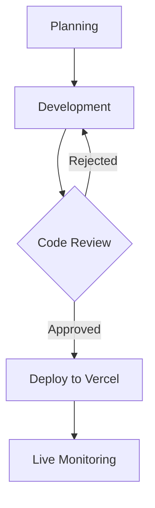

# 🍜 Asian Soul - Experiência Gastronômica Asiática  

[](https://restaurante-asian-soul.vercel.app/)
[](LICENSE)

## ✨ Destaques do Projeto  

Projeto front-end completo desenvolvido para **portfólio profissional**, simulando o website de um restaurante premium especializado em culinária asiática autêntica.  

🔹 **Destaques Técnicos:**  
✅ Design 100% responsivo com mobile-first  
✅ Sistema de abas para cardápio interativo  
✅ Animações CSS/JS otimizadas para performance  
✅ Formulário de contato funcional  
✅ Integração com Google Maps  
✅ SEO semântico e acessibilidade  

🔹 **Fluxo Profissional:**  
🚀 CI/CD automatizado com Vercel  
🔀 Versionamento com Git Flow  
📝 Commits semânticos e atomicos  
🔍 Code reviews via Pull Requests  

## 🛠 Stack Tecnológica  

| Front-end          | Ferramentas           | DevOps           |
|--------------------|-----------------------|------------------|
|  |  |  |
|  |  |  |
|  |  |  |

## 🎯 Metodologia de Trabalho  



1. **Versionamento:**  
   - Branches estruturadas (`feature/`, `fix/`, `hotfix/`)  
   - Conventional Commits  
   - GitHub Projects para gestão  

2. **Deploy Contínuo:**  
   - Preview automático para cada PR  
   - Deploy em produção via merge no `main`  
   - Otimizações automáticas (minify, cache)  

3. **Melhorias Contínuas:**  
   - Monitoramento via Vercel Analytics  
   - A/B testing de componentes  

## 🚀 Como Executar  

```bash
# Clone o repositório
git clone https://github.com/seu-user/asian-soul.git

# Abra no navegador
cd asian-soul && start index.html
```

**Ou acesse diretamente:**  
👉 [restaurante-asian-soul.vercel.app](https://restaurante-asian-soul.vercel.app)

## 📂 Estrutura do Código  

```
asian-soul/
├── assets/
│   ├── css/
│   │   └── style.css    # Estilos customizados
│   └── js/
│       └── script.js    # Lógica principal
├── img/                 # Assets otimizados
├── index.html           # Página principal
└── README.md            # Documentação
```

## 🤝 Créditos  

- Design desenvolvido com referências do Behance  
- Apoio técnico do [DeepSeek Chat](https://deepseek.com) para:  
  - Otimização de performance  
  - Padrões de código  
  - Solução de desafios técnicos  

## 📄 Licença  

Este projeto está licenciado sob a licença MIT - veja o arquivo [LICENSE](LICENSE) para detalhes.

---

**Desenvolvido com ❤️ por [Alex Magalhães](https://linkedin.com/in/alex-magalhaes-lkn)**  
[](https://meuportfolio.com)  
[](mailto:seu@email.com)  

*"Um projeto não é apenas código, é a materialização de soluções criativas."*
